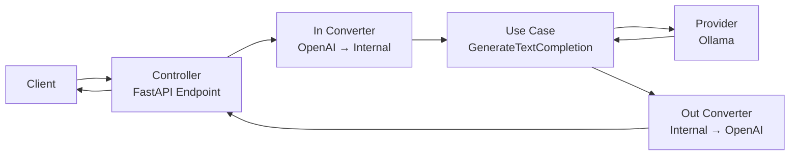
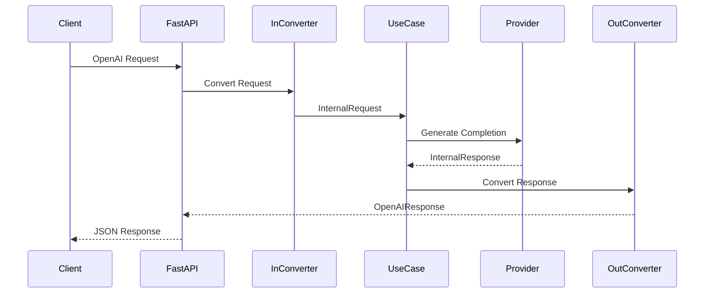

# OpenAI Compatible Orchestration

A small project built to learn:

* Python
* FastAPI
* Dependency Injection
* OpenAI-Compatible APIs
* Clean Architecture

The application acts as a lightweight proxy between an OpenAI-compatible client and a provider (currently Ollama).

---

## Goals

This project is intentionally simple.

The main purpose is to understand:

* How to separate business logic from frameworks
* How to isolate external dependencies
* How to use dependency injection
* How requests and responses flow through Clean Architecture layers

---

## Architecture Overview



---

## Project Structure

```txt
.
├── adapters
│   ├── controllers
│   │   └── external_to_internal_openai.py
│   ├── presenters
│   │   └── internal_to_external_openai.py
│   └── openai_schema.py
│
├── domain
│   └── models.py
│
├── infrastructure
│   ├── interfaces
│   │   └── i_provider.py
│   └── providers
│       └── ollama.py
│
├── use_cases
│   └── generate_text_completion.py
│
├── dependencies.py
├── main.py
└── requirements.txt
```

---

## Layer Responsibilities

### Domain

Contains enterprise models and business entities.

Examples:

* InternalRequest
* InternalResponse
* Message
* UsageStats

The domain should not know anything about:

* FastAPI
* Ollama
* OpenAI SDK
* Databases
* HTTP

---

### Use Cases

Contains application-specific business rules.

Example:

```python
GenerateTextCompletionUseCase
```

Responsibilities:

* Receive an internal request
* Apply business logic
* Call a provider
* Return an internal response

The use case should not know:

* How HTTP works
* Which AI provider is used
* Which framework is running

---

### Infrastructure

Contains implementations of external services.

Current provider:

```txt
OllamaProvider
```

Responsibilities:

* Call the OpenAI SDK
* Communicate with Ollama
* Convert provider responses

If we later add:

* OpenAI
* Gemini
* Claude

they can be implemented as additional providers without changing the use case.

---

### Adapters

Responsible for converting data between external and internal formats.

#### Controllers

Convert incoming requests.

Example:

```txt
OpenAIRequest
    ↓
InternalRequest
```

#### Presenters

Convert outgoing responses.

Example:

```txt
InternalResponse
    ↓
OpenAIResponse
```

This keeps external schemas isolated from business logic.

---

### Framework Layer

FastAPI lives here.

Example:

```python
@app.post("/v1/chat/completions")
```

Responsibilities:

* Receive HTTP requests
* Inject dependencies
* Return HTTP responses

The framework should contain as little business logic as possible.

---

## Request Flow



---

## Running

Install dependencies:

```bash
pip install -r requirements.txt
```

Start the API:

```bash
uvicorn main:app --reload
```

Open:

```txt
http://localhost:8000/docs
```

---

## Example Request

```bash
curl -X POST http://localhost:8000/v1/chat/completions \
-H "Content-Type: application/json" \
-d '{
  "model": "gemma3:270m",
  "messages": [
    {
      "role": "user",
      "content": "Hello!"
    }
  ],
  "max_tokens": 128
}'
```

---

## Future Improvements

* Streaming responses
* Memory layer
* Prompt engineering pipeline
* Multiple providers
* Provider routing
* Authentication
* Observability and logging
* Better test coverage

---

## Learning Notes

The most important lesson from this project is:

> Dependencies should point inward.

The business rules should not depend on FastAPI, OpenAI SDK, Ollama, or any external framework.

Instead, external components depend on abstractions defined closer to the core of the application.
